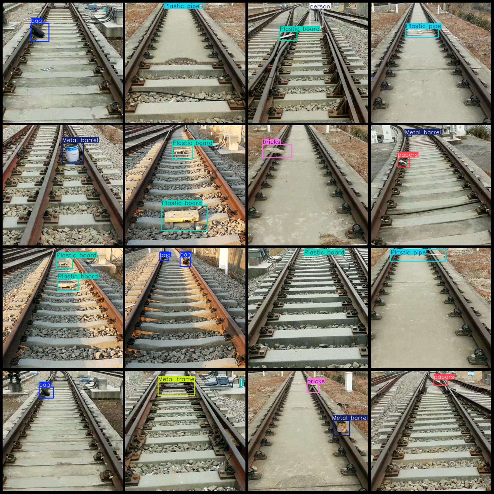
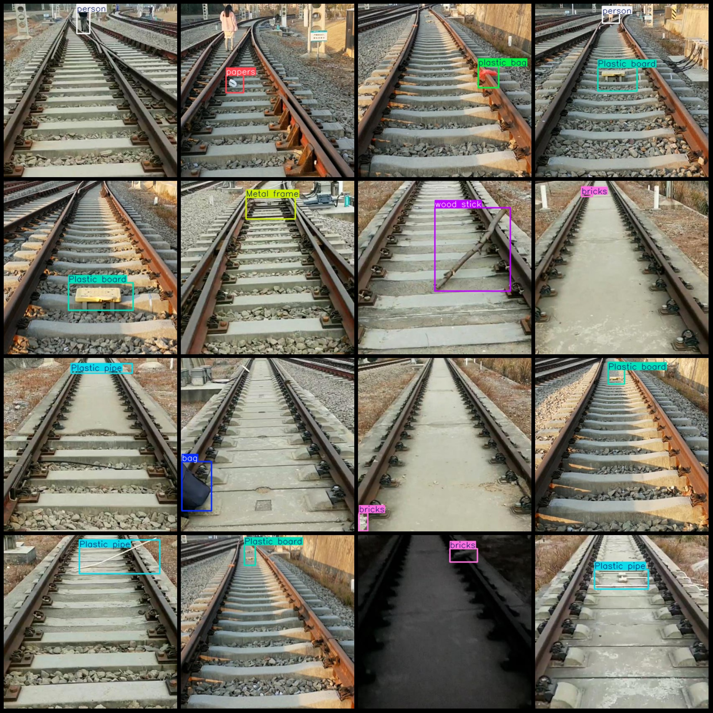

# Smart Railway Track Object Detection Dataset (VOC+YOLO format, 552 images, 11 categories)

The dataset is in Pascal VOC format + YOLO format, without the split path in the txt file. It only includes jpg images and corresponding VOC format xml files as well as YOLO format txt files.

Number of images (jpg file count): 552
Number of annotations (xml file count): 552
Number of annotations (txt file count): 552
Number of annotation categories: 11
Annotation category names (note that the order in the YOLO format does not match this one, but refer to the "labels" folder's "classes.txt" for consistency): ["Metal barrel", "Metal frame", "Plastic board", "Plastic pipe", "Wire", "bag", "bricks", "papers", "person", "plastic bag", "wood stick"]

Box counts for each category:
- Metal barrel box count = 70
- Metal frame box count = 34
- Plastic board box count = 134
- Plastic pipe box count = 124
- Wire box count = 5
- Bag box count = 59
- Bricks box count = 90
- Papers box count = 49
- Person box count = 50
- Plastic bag box count = 19
- Wood stick box count = 33
Total box count: 667
Image resolution: 416x416
Annotation tool used: labelImg
Annotation rules: draw boxes around categories
Important note: No specific instructions provided at this time.
Special declaration: This dataset does not guarantee accuracy in training models or weight files.

Example annotation:
## Images

Here is a pay link on Stripe ( https://buy.stripe.com/3cs8yP7sY87d0vu9AB ). Please contact me lonlonago@foxmail.com after funding $89, and I will send you a complete data files , thank you!

